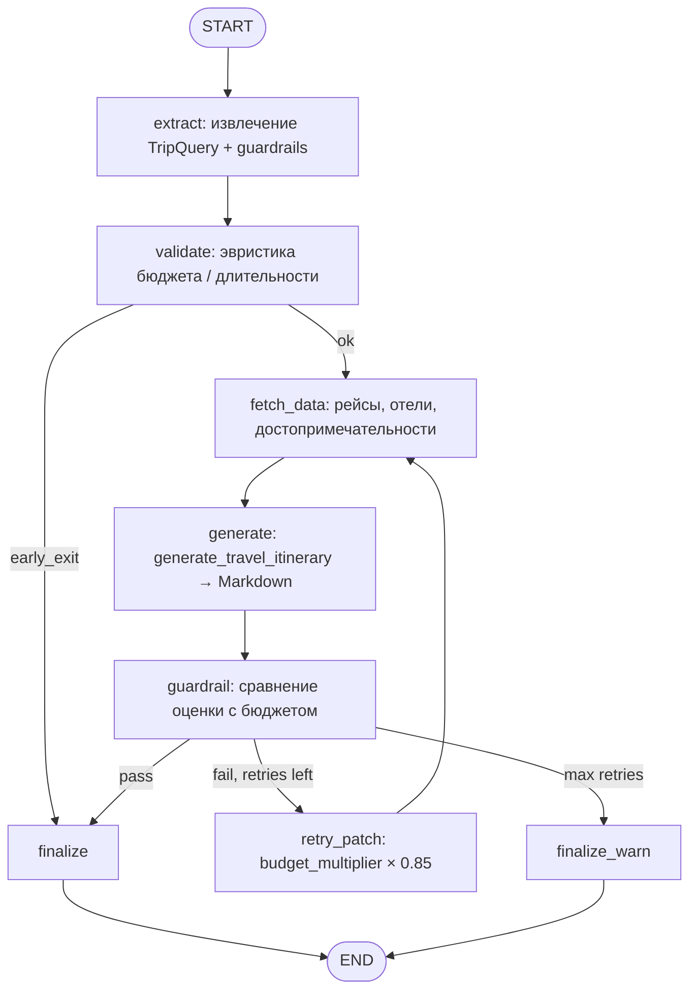

# AI Travel Planning Agent

PoC агентной системы для планирования поездок: извлечение параметров из текста (LLM), поиск рейсов и отелей ([Travelpayouts](https://www.travelpayouts.com/) / Aviasales API), подсказки по достопримечательностям, генерация маршрута в Markdown и проверка бюджета. Оркестрация — **LangGraph** (`backend/agent_graph.py`); LLM — **LangChain `ChatOpenAI`** к OpenAI-совместимому HTTP API (`AGENTPLATFORM_API_BASE`), без пакета LiteLLM.

**Мониторинг:** Prometheus + Grafana дашборды, Langfuse трассировка с автоматическими score-метриками и dataset-экспериментами.

---

## Архитектура агента

### Схема работы (LangGraph)



### Компоненты системы

```
┌─────────────────────────────────────────────────────────────────┐
│                      Streamlit UI (8501)                         │
│  ┌───────────────────────────────────────────────────────────┐  │
│  │               travel_facade.py                             │  │
│  │  ┌─────────────────────────────────────────────────────┐  │  │
│  │  │          LangGraph (agent_graph.py)                  │  │  │
│  │  │  ┌─────────┐ ┌──────────┐ ┌───────────┐ ┌────────┐  │  │  │
│  │  │  │ extract  │→│ validate │→│ fetch_data │→│generate│  │  │  │
│  │  │  └─────────┘ └──────────┘ └───────────┘ └────────┘  │  │  │
│  │  │       ↓                              ↓               │  │  │
│  │  │  ┌──────────┐ ┌──────────┐ ┌──────────────┐         │  │  │
│  │  │  │guardrail │→│retry_patch│→│  finalize    │         │  │  │
│  │  │  └──────────┘ └──────────┘ └──────────────┘         │  │  │
│  │  └─────────────────────────────────────────────────────┘  │  │
│  │                                                             │  │
│  │  LLM Observability │ Prometheus │ Langfuse                  │  │
│  └───────────────────────────────────────────────────────────┘  │
└─────────────────────────────────────────────────────────────────┘
         ↓                    ↓                    ↓
   Travelpayouts         Prometheus:9090      Langfuse Cloud
   (рейсы/отели)         /metrics             (traces/scores)
```

### Кратко по шагам графа

| Узел | Назначение | Langfuse Span |
|------|-----------|---------------|
| `extract` | Извлечение `TripQuery` из текста, guardrails | ✅ `extract_intent` |
| `validate` | Эвристика бюджета/длительности | ✅ `validate_constraints` |
| `fetch_data` | Рейсы + отели (Travelpayouts), достопримечательности (LLM) | ✅ `fetch_data` |
| `generate` | Генерация маршрута в Markdown | ✅ `generate_itinerary` |
| `guardrail` | Проверка: перелёт + отель×ночи ≤ бюджет | ✅ `budget_guardrail` |
| `retry_patch` | budget_multiplier × 0.85, повторный поиск | — |
| `finalize` | Формирование итогового Markdown | — |

Состояние сессии: **MemorySaver** (in-process), изоляция по `thread_id`.

---

## Инструменты агента (`backend/agent_tools.py`)

| Инструмент | Назначение | LLM |
|------------|-----------|-----|
| `search_flights` | Авиапоиск по городам/датам (Travelpayouts) | — |
| `search_hotels` | Поиск отелей по городу/датам | — |
| `search_attractions` | Идеи мест в городе (LLM) | ✅ `city_attractions` |
| `extract_travel_requirements` | Извлечение `TripQuery` из текста | ✅ `trip_extraction` |
| `check_travel_budget` | Проверка бюджета | — |
| `generate_travel_itinerary` | Генерация Markdown-маршрута | ✅ `travel_itinerary` |
| `validate_travel_constraints` | Эвристика «бюджет vs дни» | — |

---

## Мониторинг и наблюдаемость

### Prometheus метрики

| Тип | Метрики |
|-----|---------|
| **Планирование** | requests total, duration (p50/p95), outcome, HTTP codes |
| **LLM Performance** | TTFT (prefill), decode phase, ITL (inter-token), input/output tokens, cost USD |
| **Бизнес-метрики** | пассажиры, бюджет (по валютам), длительность, города вылета/назначения, retry count, итоговая стоимость |
| **Системные** | CPU %, RSS памяти |

### Grafana дашборды

**1. Travel Agent — LLM & planning** (`travel-monitoring.json`)
- Planning requests rate (ops)
- Planning latency p50/p95
- LLM TTFT prefill vs decode (p95)
- LLM inter-token latency (p95)
- Токены/сек (input + output)
- Стоимость LLM (USD/s)
- CPU и RSS

**2. Travel Agent — Analytics Dashboard** (`travel-analytics.json`)
- 📊 **KPI Cards:** запросы, латентность, стоимость LLM, токены, бюджет, success rate
- 🌍 **Travel Analytics:** топ городов вылета/назначения, маршруты
- 💰 **Budget & Cost:** распределение бюджетов, итоговая стоимость, бюджет vs реальная стоимость
- 👥 **Passengers & Trip Details:** пассажиры, длительность, валюты, тип поиска
- ⚡ **LLM Performance:** TTFT, ITL, токены/сек, скорость генерации
- 🔄 **System & Reliability:** requests rate, latency, guardrail retries, CPU/RSS

### Langfuse трассировка

| Возможность | Описание |
|-------------|----------|
| **Trace** | Полный вызов графа (extract → validate → fetch → generate → guardrail) |
| **Spans** | Каждый узел графа — отдельный span с metadata |
| **Generations** | LLM-вызовы с промптами, ответами, токенами |
| **Score-метрики** | `budget_compliance` (0-1), `latency_rating`, `success_score` |
| **Datasets** | Автоматическое сохранение пар запрос/ответ для A/B тестирования |

Запуск мониторинга:
```bash
docker compose --profile monitoring up --build
```

| Сервис | URL |
|--------|-----|
| Streamlit UI | `http://localhost:8501` |
| Prometheus metrics | `http://localhost:9090/metrics` |
| Prometheus UI | `http://localhost:9091` |
| Grafana | `http://localhost:3000` |

Подробнее: [monitoring/README.md](monitoring/README.md)

---

## Запуск

### Требования

- Python 3.10+
- Ключи: **`AGENTPLATFORM_API_KEY`** (или `OPENAI_API_KEY`), **`TRAVELPAYOUTS_API_TOKEN`**

### Локально (Streamlit)

```bash
pip install -r requirements.txt
```

Создайте `.env` из шаблона:
```bash
cp .env.example .env
# Отредактируйте .env — вставьте ключи
```

```bash
streamlit run streamlit_app.py
```

Откройте URL из вывода (обычно `http://localhost:8501`).

### Тесты

```bash
make test
# или
python -m pytest tests/ -v
```

CI: [`.github/workflows/ci.yml`](.github/workflows/ci.yml) — pytest + проверка импорта `build_graph()`.

### Docker

```bash
# Только UI
docker compose up --build

# UI + полный стек мониторинга
docker compose --profile monitoring up --build
```

Переменные окружения берутся из `.env` рядом с `docker-compose.yml`.

---

## Документация

| Файл | Содержание |
|------|------------|
| [docs/system-design.md](docs/system-design.md) | Полная архитектура PoC: модули, flow, состояние |
| [docs/architecture-microservices.md](docs/architecture-microservices.md) | Deployment: один процесс, Docker |
| [docs/product-proposal.md](docs/product-proposal.md) | Продуктовое видение, success-метрики |
| [docs/governance.md](docs/governance.md) | Риски, PII, prompt injection защита |
| [docs/specs/agent-orchestrator.md](docs/specs/agent-orchestrator.md) | Узлы LangGraph, conditional edges, retry |
| [docs/specs/memory-context.md](docs/specs/memory-context.md) | MemorySaver, thread_id, TravelPlanningState |
| [docs/specs/tools-APIs.md](docs/specs/tools-APIs.md) | Tool контракты, таймауты |
| [docs/specs/observability-evals.md](docs/specs/observability-evals.md) | LLM метрики, Prometheus, Langfuse, evals |
| [docs/specs/serving-config.md](docs/specs/serving-config.md) | Env vars, deployment, model versions |
| [docs/specs/retriever.md](docs/specs/retriever.md) | RAG не реализован; альтернатива — LLM |
| [docs/diagrams/](docs/diagrams/) | C4 diagrams (context, container), data-flow, workflow |
| [monitoring/README.md](monitoring/README.md) | Prometheus, Grafana дашборды, Langfuse интеграция |

---

## Технологии

- **[LangGraph](https://langchain-ai.github.io/langgraph/)** — граф состояний, чекпоинты (MemorySaver)
- **[LangChain](https://python.langchain.com/)** — `ChatOpenAI` + `base_url` (OpenAI-совместимый API)
- **[Streamlit](https://docs.streamlit.io/)** — веб-интерфейс с дашбордами
- **[Travelpayouts / Aviasales](https://support.travelpayouts.com/)** — рейсы и отели (read-only)
- **[Pydantic](https://docs.pydantic.dev/)** — валидация данных (`TripQuery`)
- **[Prometheus](https://prometheus.io/)** + **[Grafana](https://grafana.com/)** — метрики и дашборды
- **[Langfuse](https://langfuse.com/)** — трассировка LLM, scores, datasets
- **[Plotly](https://plotly.com/)** — интерактивные графики цен
- **[Folium](https://python-visualization.github.io/folium/)** — карта достопримечательностей (OpenStreetMap)

---

## Ограничения PoC

- Нет реального бронирования и оплаты
- Оценки бюджета ориентировочные
- Покрытие городов и API зависит от Travelpayouts
